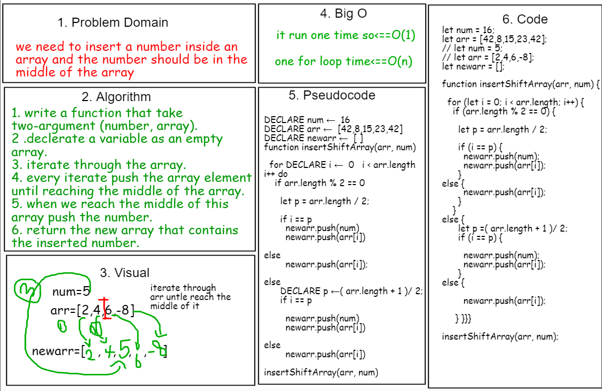

# Insert to Middle of an Array
## this code challenge 02 requires me to write a function that takes two arguments (array, number) and it asks me to insert that number inside that array but the number should be inserted in the middle of this array.

## i divide every condition alone so if the array was contain an odd number i made a condition and the same thing for the enen array 
## Why. What is the Big O space/time for this approach?

- it is runing for one time the big O time<==O(1).
- and because it is one for loop time<==O(n). 