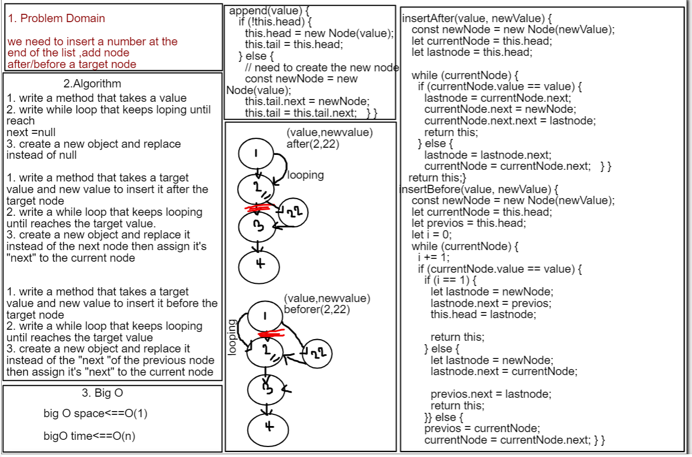

# linked-list-insertions code challenge 06
## this challenge is asking to create a Singly Linked Lists that contain a insert methods (which allows us to add a new node:at the first ,the end of the list ,before a target node ,and after target node ).
## Whiteboard Process

# test unit 
- [x] Can successfully add a node to the end of the linked list.
- [x] Can successfully add multiple nodes to the end of a linked list.
- [x] Can successfully insert a node before a node located i the middle of a linked list.
- [x] Can successfully insert a node before the first node of a linked list.
- [x] Can successfully insert after a node in the middle of the linked list.
- [x] Can successfully insert a node after the last node of the linked list.
- [x] Can successfully instantiate an empty linked list.

## Approach & Efficiency

- Singly Linked Lists why? it is a simple data structur time:  Big O =O(n)
space:  Big O =O(1)

