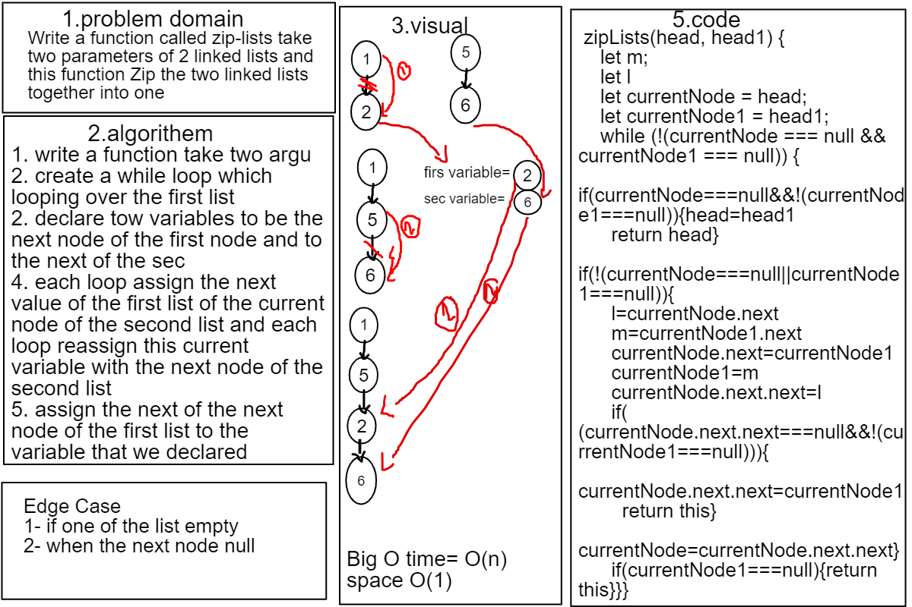

# Challenge Summary
## this challenge is asking to Write a function called zip-lists take two parameters of 2 linked lists and this function Zip the two linked lists together into one so that the nodes alternate between the two lists and return a reference to the head of the zipped list.

## Whiteboard Process

## Approach & Efficiency
- i wrote a function contain one while loop   Big O time =O(n) Big O space=O(1)

##
[Link to the code](https://github.com/marwanrawshedh/data-structures-and-algorithms/blob/main/javascript-401/code-challenge08/lib/ZipLinkedList.js)
