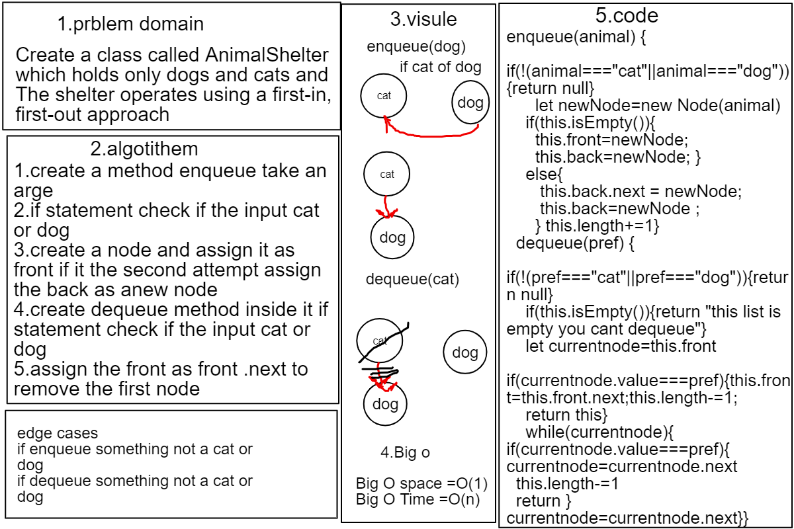

# AnimalShelter

## Challenge
### this challenge requires Create a class called AnimalShelter which holds only dogs and cats andThe shelter operates using a first-in, first-out approach
- enqueue
- dequeue

## Approach & Efficiency
### we implement in this code challenge queues and it's method has Big O(1) space and Big O(n)time

- Enqueue : Nodes or items that are added to the queue.
- Dequeue: Nodes or items that are removed from the queue. If called when the queue is empty an exception will be raised.

