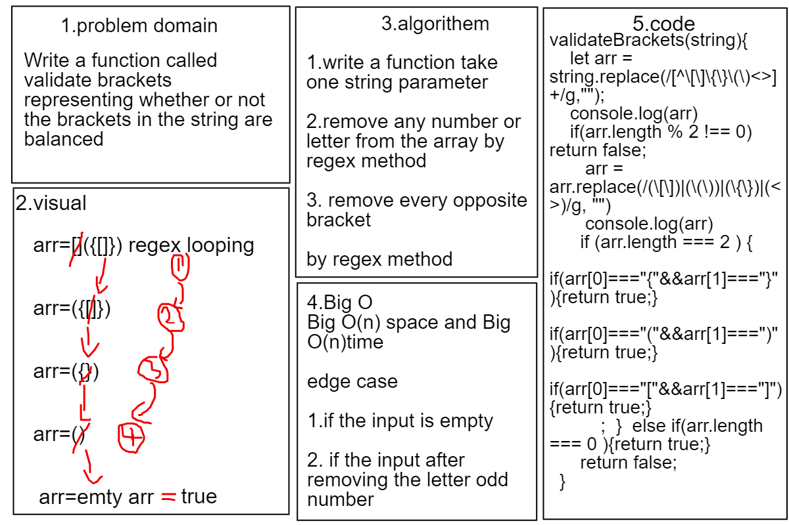

# Multi-bracket Validation.

## Challenge
### this challenge ask to Write a function called validate brackets representing whether or not the brackets in the string are balanced
## Approach & Efficiency
### i implement in this code challenge regex javascript the function has Big O(n) space and Big O(n)time

