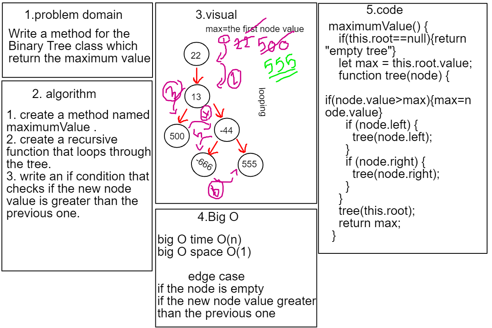

# tree-max Challenge16

# Binary  Tree-max
## Write a method for the Binary Tree class which return the maximum value.

## Approach & Efficiency
- Big O Space O(n)
- Big O Time O(1)

## API
- maximumValue:method return the maximum node value.

