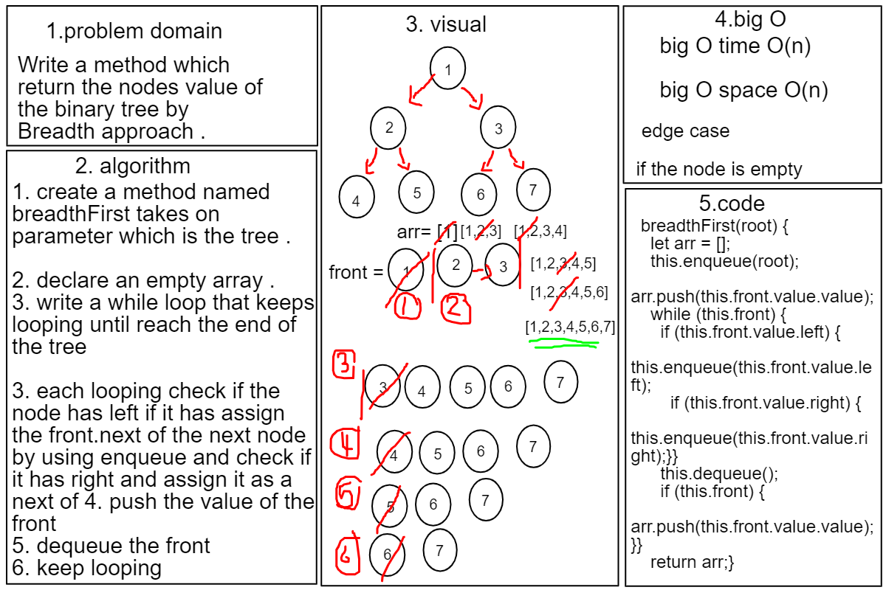

# Breadth-first Traversal Challenge17

# Binary  Breadth-first Traversal
## Write a function called breadth first that return an array of breadth approach 

## Approach & Efficiency
- Big O Space O(n)
- Big O Time O(n)

## API
- breadthFirst:method return an array of the nodes value of breadth approach .

