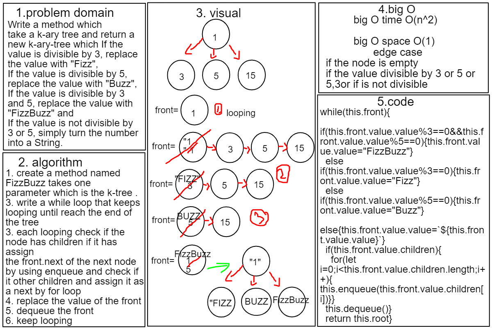

# k-ary-tree-fizz-buzz Challenge18

# k-ary-tree-fizz-buzz
## Write a method  named FizzBuzz which take a k-ary tree and return a new k-ary-tree which If the value is divisible by 3, replace the value with "Fizz",If the value is divisible by 5, replace the value with "Buzz",If the value is divisible by 3 and 5, replace the value with "FizzBuzz" and If the value is not divisible by 3 or 5, simply turn the number into a String. 

## Approach & Efficiency
- Big O Space O(1)
- Big O Time O(n^2)

## API
- FizzBuzz:method return a new k-ary-tree of breadth approach .

