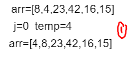
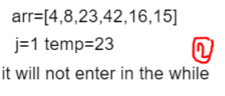
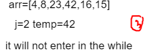
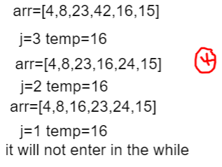
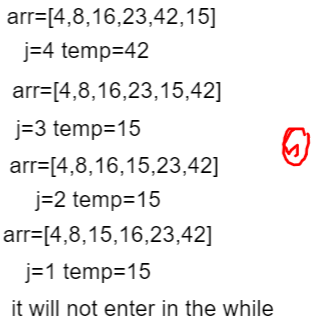

# in the for loop each time it will compare the seconed with the first element if it smaller it will replace their places

# in the second trail it will compare the 3th element with the second element and it greater than it so it will not enter inside the while loop

# in the 3th trail it will compare the 4th element with the 3th one and it greater than it so it will not enter inside the while loop

# in the 4th trail it will compare the 5th element with the 4th one and it smaller than it so they will replace their enter inside the while loop
- it wil compare the 4th element with the 3th one and it smaller than it so they will replace their place
- it wil compare the 3th element with the second one and it greater than it so it will not enter inside the while loop

# in the 5th trail it will compare the 6th element with the 5th one and it smaller than it so they will replace their places 
- it wil compare the 5th element with the 4th one and it smaller than it so they will replace their place.
- it wil compare the 4th element with the 3th one and it smaller than it so they will replace their place.
- it wil compare the 3th element with the second one and it greater than it so it will not enter inside the while loop.

