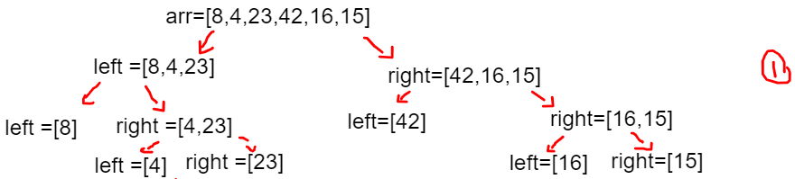
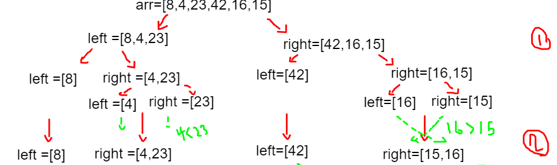
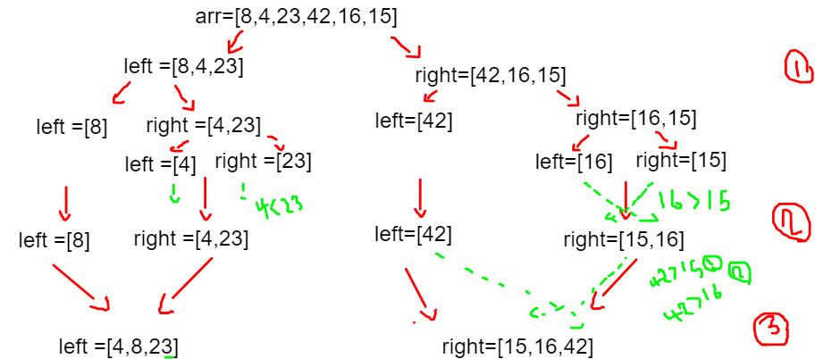
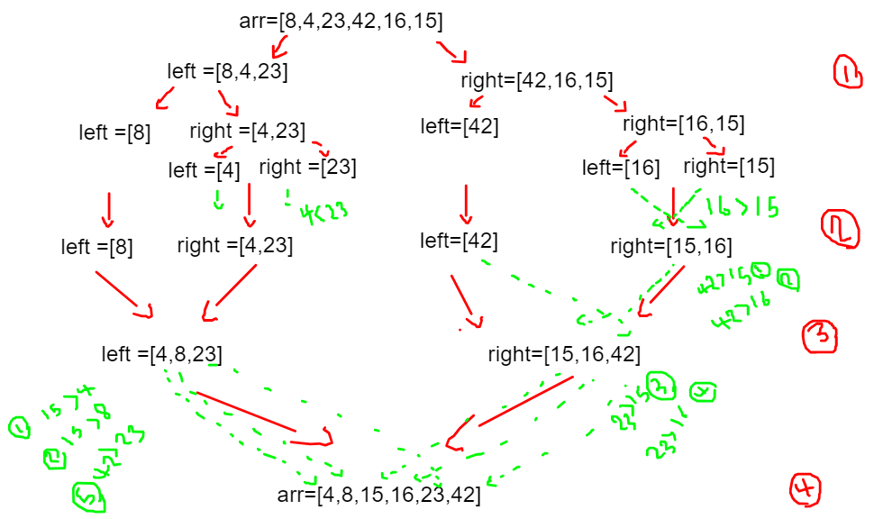

# in the first steep it will divide the array into two section lft and right and it will take the left and it will divide it into anther two arry left and right and the same thing with the right arry and it will kepp doig that until reach arr.lenght smaller or equal 1 

# after dividing the array into small picecs of array it will compare each element togther if the second is smaller than the first  they  will replace their palces  

# in the 3th trail it will get back one step from the recursion function and compare the the left array with the right one and replace their places 

# in the 4th trail it will get back another step from the recursion function and compare the the left array with the right one and replace their places 

