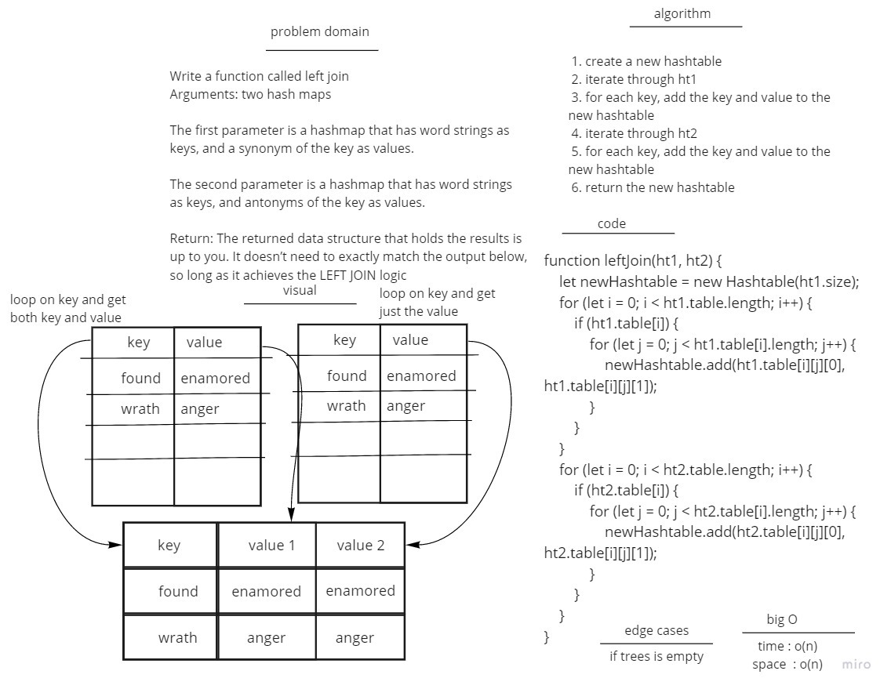

# Hashtables
 
## Approach & Efficiency
- big o time of read is O(n)
- space O(n)
## whiteboard

# test
- [x] The returned data structure that holds the results is up to you. It doesn’t need to exactly match the output below, so long as it achieves the LEFT JOIN logic.

